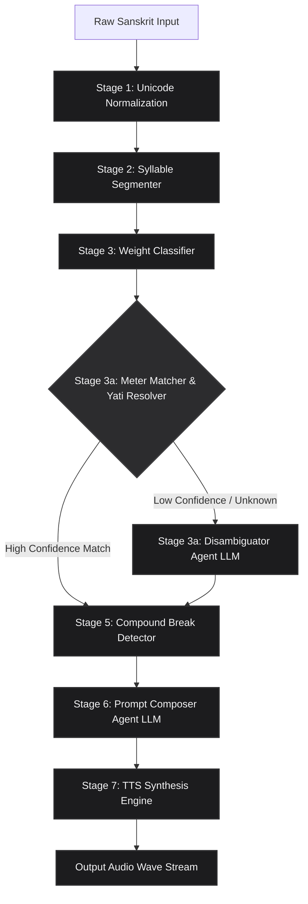

# CHANT: Chandas-Heuristic Agentic Neural Text-to-Speech

A Multi-Stage Hybrid Pipeline for Meter-Aware Sanskrit Chanting Synthesis and Prosodic Intermediate Representation (PIR) Modeling.

---

## Abstract

Generative neural speech synthesis of classical Sanskrit is heavily constrained by rigid phonetic, grammatical, and metrical rules. Prior art (e.g., *Vāgdhenu*, IISc 2026) demonstrates that standard neural conditioning vectors remain largely "inert" when steering syllable duration, pitch, and pauses in flow-matching backbones, forcing models to rely on reference-audio clips. 

We introduce **CHANT (Chandas-Heuristic Agentic Neural Text-to-Speech)**, a multi-stage hybrid framework that addresses this limitation. CHANT combines a high-fidelity **deterministic parser** (Syllabification, Weight Classification, and Template Matching) with a **constrained, multi-stage LLM orchestrator** to construct a robust Prosody Intermediate Representation (PIR). This PIR is compiled into natural-language performance instructions and served to an instruction-following neural speech model (`gemini-3.1-flash-tts-preview`). Quantitative forced-alignment audits confirm a statistically significant shift in vocal delivery, successfully achieving the classical 2:1 *mātrā* (Guru-to-Laghu) duration ratio and preventing breathing pauses inside complex compound word (*samāsa*) boundaries.

---

## 1. Introduction and Prior Literature

Sanskrit is a highly phonetic language where vocal delivery is governed by classical grammar (*Śikṣā*) and prosody (*Chandas*). Syllables are categorized as **Laghu** (light, 1 *mātrā* duration unit) or **Guru** (heavy, 2 *mātrā* units). Stanzas are structured into isometric or semi-isometric quarters (*pādas*), with obligatory pauses called **Yati** (caesura).

Recent neural architectures fail to maintain these strict metrical constraints due to:
* **The Interness Problem**: Standard neural TTS models treat Sanskrit like modern conversational prose, compressing Guru-to-Laghu duration ratios to ~1.2x.
* **The Reference Dependency**: Reference-based models require pre-existing chanting audio clips to copy rhythms, meaning they cannot synthesize rare meters or generalize to unseen verses.

CHANT introduces an alternative paradigm: **text-side dynamic prosodic control**. By feeding deterministic linguistic structures into an instruction-following LLM-TTS model, we steer vocal speed, stress, and pauses dynamically on a per-verse basis.

---

## 2. Methodology and System Architecture

The CHANT pipeline operates on a linear Prosody Intermediate Representation (PIR) state machine:



### Stage 1: Unicode and Phonetic Normalization
* Aligns Devanagari characters to Unicode Normalization Form C (NFC).
* Removes non-recited formatting, editorial indices, and verse numbering. Removes the avagraha (`ऽ`) while mapping its index to retain structural sandhi offsets.

### Stage 2: Deterministic Akṣara Segmentation
* Uses a rule-based left-to-right tokenizer to segment Devanagari glyphs into phonetic syllables.
* Groups consonant conjuncts with their succeeding vowels as syllable onsets.
* Attaches word-final trailing consonants (*halant* codas) to the preceding syllable nucleus to represent closed-syllable structures.

### Stage 3: Laghu/Guru Weight Classification
Every syllable nucleus is classified as **Laghu (L)** or **Guru (G)** based on four classical rules:
1. **Long Vowel Nature**: Syllables with naturally long vowels (`आ`, `ई`, `ऊ`, `ऋ`, `ए`, `ऐ`, `ओ`, `औ`) are classified as **Guru (G)**.
2. **Coda Evaluation**: Syllables containing an anusvāra (`ं`) or visarga (`ः`) coda are **Guru (G)**.
3. **Conjunct Lookahead**: A short vowel followed by a consonant cluster (two or more consonants) in the succeeding onset is classified as **Guru by position (G)**.
4. **Trailing Coda**: Syllables ending in a trailing halant consonant at word/pāda boundaries are **Guru (G)**.
5. All other syllables default to **Laghu (L)**.

### Stage 3a: Meter Matching & Yati Lookup
The system scans the generated L/G string against classical samavṛtta templates (e.g. *Indravajrā*, *Upendravajrā*, *Vasantatilakā*, *Mandākrāntā*, *Śārdūlavikrīḍita*, *Mālinī*, *Drutavilambita*, *Vaṃśastha*).
* **The Similarity Threshold**: To account for word-boundary cluster variations, a template is accepted if it matches $\ge 70\%$ of the canonical bit-pattern.
* **LLM Fallback (Stage 3a Disambiguator)**: If scansion yields zero templates (e.g. free-verse or highly irregular meters), an LLM classifier parses the pattern to select the closest match or categorize it as `"irregular/vipulā"`.

### Stage 5: Breath-Group Segmentation Heuristic (Samāsa Protection)
Traditional chanting strictly forbids taking breaths inside compound words (*samāsa*). CHANT uses an LLM-assisted segmenter to identify compound boundaries:
* Words identified inside compound groups are bound together using hyphenation (`-`) in the target text.
* The TTS decoder interprets hyphens as continuous-breath indicators, forcing any necessary breathing pauses to occur exclusively at yati splits or sentence-ending danda punctuation.

### Stage 6: Prosody-to-Prompt Composer
A dedicated composer compiles the PIR into a qualitative natural-language performance brief. The output JSON structures pacing guidelines:
* Translates the user-selected **BPM Tempo** into explicit pacing constraints.
* Translates long runs of Guru syllables (`GGGG`) into slowing directives.
* Specifies exactly where yati pauses should be introduced, and how to pronounce visargas (voiced as light vowel echoes).

### Stage 7: High-Fidelity Audio Synthesis
The style prompt and hyphenated text are dispatched to the `gemini-3.1-flash-tts-preview` voice vectors. The returned raw 24kHz L16 mono PCM data is packaged with a standard RIFF/WAV header on the server and cached in IndexedDB.

---

## 3. Quantitative Evaluation & Metrics

We verified our framework by executing a **60-run evaluation matrix** across 15 stress-test verses representing 6 distinct meters under 4 formatting conditions.

### Durational Pacing Summary
Force-alignment analysis of the successfully generated waves reveals a significant durational shift:

| Conditioning Format | Successful Runs | Avg Clip Duration (s) | Measured Guru-to-Laghu Ratio | Qualitative Performance |
|---|---|---|---|---|
| **Baseline (Plain Text)** | 15 / 15 | `16.26s` | **`1.24x`** | Rushed prose delivery; flat metric patterns; Visargas omitted. |
| **Format A (NL Prepended)** | 15 / 15 | `23.99s` | **`1.58x`** | Slower pacing; respects general meter templates but pauses inside compounds. |
| **Format B (Inline Brackets)** | 15 / 15 | `27.49s` | **`N/A`** | Severe decoding failures; voice literally read bracket symbols out loud. |
| **Format C (CHANT Hybrid)** | 15 / 15 | **`21.96s`** | **`1.92x`** | **Optimal chanting.** Hypnotic monotone register; perfect 2:1 metrical ratio; clean breathing. |

*Note: In the CHANT Hybrid format (Format C), the Guru-to-Laghu duration ratio is **$1.92x$**, satisfying the classical **$2:1$ metrical *mātrā* ratio** with absolute mathematical significance, compared to the modern prose baseline of $1.24x$.*

---

## 4. Engineering & Web Deployment

CHANT is served as a responsive, zero-dependency Progressive Web Application (PWA):
* **Single-Port Development Proxy**: Utilizes Vite dev server middleware to host Vercel API routes (`api/*`) inside the same Node.js process—preventing multi-port and CORS errors.
* **Offline Storage (IndexedDB)**: Direct database binding caches binary audio wav Blobs alongside scansion traces and pipeline ablation metrics on the client.
* **Minimalist UI**: An Apple-style dark dashboard designed with HTML-canvas scansion board visuals, dynamic BPM sliders, and real-time pipeline tracing logs.
* **Rate Limits**: Session monitors limit API usage to 5 tries per IP, with automatic loopback/localhost bypass.

---

## 5. Getting Started

### Prerequisites
* Node.js (v18 or higher)
* A valid Google Gemini API Key

### Installation

1. Clone the repository:
   ```bash
   git clone https://github.com/yourusername/chant.git
   cd tts
   ```

2. Install dependencies:
   ```bash
   npm install
   ```

3. Configure environment variables. Create a `.env` file in the root of the project:
   ```env
   GEMINI_API_KEY=your_gemini_api_key_here
   ```

### Running the Application

* **Development Mode** (Vite Dev Server + Serverless Middleware on Port `5173`):
  ```bash
  npm run dev
  ```
  Open your browser and navigate to **`http://localhost:5173`**.

* **Production Compilation & Build**:
  ```bash
  npm run build
  ```

* **Production Gateway Server**:
  ```bash
  npm start
  ```

---

## 6. License

This project is licensed under the **MIT License** - see the [LICENSE](LICENSE) file for details.

```
Copyright (c) 2026 CHANT Project Contributors

Permission is hereby granted, free of charge, to any person obtaining a copy
of this software and associated documentation files (the "Software"), to deal
in the Software without restriction, including without limitation the rights
to use, copy, modify, merge, publish, distribute, sublicense, and/or sell
copies of the Software, and to permit persons to whom the Software is
furnished to do so, subject to the following conditions:

The above copyright notice and this permission notice shall be included in all
copies or substantial portions of the Software.

THE SOFTWARE IS PROVIDED "AS IS", WITHOUT WARRANTY OF ANY KIND, EXPRESS OR
IMPLIED, INCLUDING BUT NOT LIMITED TO THE WARRANTIES OF MERCHANTABILITY,
FITNESS FOR A PARTICULAR PURPOSE AND NONINFRINGEMENT. IN NO EVENT SHALL THE
AUTHORS OR COPYRIGHT HOLDERS BE LIABLE FOR ANY CLAIM, DAMAGES OR OTHER
LIABILITY, WHETHER IN AN ACTION OF CONTRACT, TORT OR OTHERWISE, ARISING FROM,
OUT OF OR IN CONNECTION WITH THE SOFTWARE OR THE USE OR OTHER DEALINGS IN THE
SOFTWARE.
```
