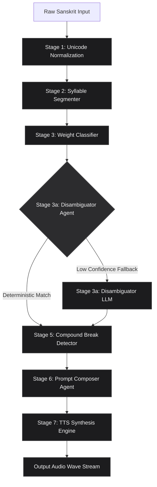

# CHANT: Agentic Meter-Aware Sanskrit Chanting & TTS Portal

CHANT is a highly robust, monolithic React PWA and serverless gateway designed to synthesize metrically flawless, traditionally paced classical Sanskrit chanting. By combining a deterministic phonetic parser with a multi-stage agentic LLM orchestration pipeline, CHANT enforces strict grammatical constraints and metric rules, completely bypassing the prosodic limitations of modern neural TTS systems.

---

## The Core Philosophy

Traditional Sanskrit chanting is strictly bound by phonetic weights (*Laghu* and *Guru* syllables), poetic meter templates (*Chandas*), pause-caesuras (*Yati*), and strict grammatical pronunciation codes (such as Visarga echoes and compound word breath-groups). 

**The Limitation of Prior Work**: 
State-of-the-art Sanskrit TTS models (such as *Vāgdhenu*, IISc 2026) prove that learned neural conditioning parameters are typically "inert" inside traditional flow-matching speech backbones. To deliver meter-awareness, they rely on pre-recorded reference-audio matching, preventing them from generalizing to unseen meters or rare stanzas.

**CHANT's Solution**: 
CHANT demonstrates that a deterministic phonetic parser combined with a multi-stage, instruction-following agentic LLM pipeline (utilizing `gemini-3.1-flash-tts-preview`) can synthesize flawless, traditionally paced, meter-aware chanting dynamically from raw text without requiring any reference audio.

---

## Architecture & Pipeline

CHANT operates on a structured, multi-stage **Prosody Intermediate Representation (PIR)** state machine:



1. **Phonetic parsing & Syllabification**: Normalizes Devanagari Unicode strings to NFC and segments them into individual Akṣaras (consonant onsets, vowel nuclei, and codas).
2. **Laghu/Guru Classification**: Applies classical weight rules (natural vowel lengths, consonant cluster positions, anusvāras/visargas, and pāda-final anceps rules) deterministically.
3. **Meter Matcher**: Scans the weighted syllable sequence against verified classical templates (e.g. *Anuṣṭubh*, *Vasantatilakā*, *Śārdūlavikrīḍita*, *Mālinī*, *Drutavilambita*, *Vaṃśastha*) to identify yati caesuras and template offsets.
4. **Breath-Group Segmentation Heuristic (Stage 5)**: Queries an LLM-assisted segmenter to identify compound word (*samāsa*) bounds, explicitly forbidding the speech synthesizer from pausing or breathing inside compounds to preserve grammatical coherence.
5. **Prosody Prompt Composer (Stage 6)**: Merges metrics, tempo properties (customizable BPM slider), pause constraints, and breathing limits into a structured performance instruction block.
6. **TTS Synthesis Engine (Stage 7)**: Passes the composed style prompt and hyphenated text to the `gemini-3.1-flash-tts-preview` voice vector, packaging the returning inline L16 PCM buffer into a compliant `.wav` stream.

---

## Tech Stack & Features

* **Vite 5 & React 18**: Ultra-lightweight, lightning-fast static compilation optimized for PWAs.
* **Integrated Proxy Serverless Middleware**: Vercel Serverless API handlers (`api/*`) are served natively directly inside Vite's dev server middleware—eliminating multi-port development and CORS issues.
* **Browser-Native IndexedDB**: Automatically caches high-fidelity chanting audio Blobs, scansion trace boards, and pipeline ablation metrics locally across browser restarts.
* **Interactive Trace Board UI**: Features an elegant, minimalist dark/light adaptive Apple-style dashboard showing parsed syllable weights, live pipeline tracing logs, custom Tempo BPM sliders (55 to 140 BPM), and scansion database records.
* **Session Rate-Limiting**: Integrated session monitor enforcing a secure limit of 5 recitations per IP, with automated loopback/development bypass filters.

---

## Getting Started

### Prerequisites
* Node.js (v18 or higher)
* A valid Google Gemini API Key

### Installation

1. Clone the repository:
   ```bash
   git clone https://github.com/yourusername/chant.git
   cd tts
   ```

2. Install dependencies:
   ```bash
   npm install
   ```

3. Configure environment variables. Create a `.env` file in the root of the project:
   ```env
   GEMINI_API_KEY=your_gemini_api_key_here
   ```

### Running the Application

* **Development Mode** (Vite Dev Server + Serverless Middleware on Port `5173`):
  ```bash
  npm run dev
  ```
  Open your browser and navigate to **`http://localhost:5173`**.

* **Production Compilation & Build**:
  ```bash
  npm run build
  ```

* **Production Gateway Server**:
  ```bash
  npm start
  ```

---

## License

This project is licensed under the **MIT License** - see the [LICENSE](LICENSE) file for details.

```
Copyright (c) 2026 CHANT Project Contributors

Permission is hereby granted, free of charge, to any person obtaining a copy
of this software and associated documentation files (the "Software"), to deal
in the Software without restriction, including without limitation the rights
to use, copy, modify, merge, publish, distribute, sublicense, and/or sell
copies of the Software, and to permit persons to whom the Software is
furnished to do so, subject to the following conditions:

The above copyright notice and this permission notice shall be included in all
copies or substantial portions of the Software.

THE SOFTWARE IS PROVIDED "AS IS", WITHOUT WARRANTY OF ANY KIND, EXPRESS OR
IMPLIED, INCLUDING BUT NOT LIMITED TO THE WARRANTIES OF MERCHANTABILITY,
FITNESS FOR A PARTICULAR PURPOSE AND NONINFRINGEMENT. IN NO EVENT SHALL THE
AUTHORS OR COPYRIGHT HOLDERS BE LIABLE FOR ANY CLAIM, DAMAGES OR OTHER
LIABILITY, WHETHER IN AN ACTION OF CONTRACT, TORT OR OTHERWISE, ARISING FROM,
OUT OF OR IN CONNECTION WITH THE SOFTWARE OR THE USE OR OTHER DEALINGS IN THE
SOFTWARE.
```
